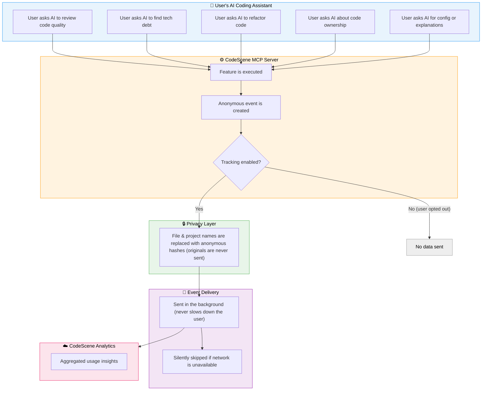
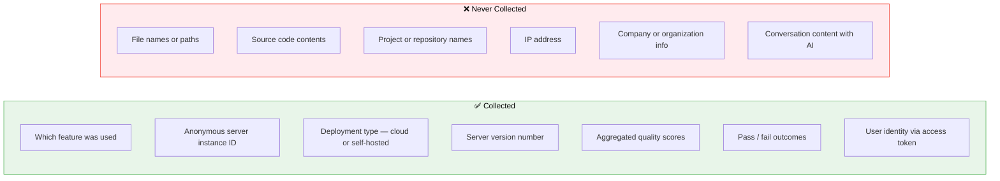

# Event Tracking Overview — CodeScene MCP Server

## How It Works

Every time a user interacts with the MCP Server through their AI coding assistant, an anonymous usage event is recorded. These events help CodeScene understand which features are used and how often — without collecting any sensitive information.

## What Features Generate Events

| Category | Features | What's Recorded |
|---|---|---|
| **Code Quality** | Score a file, Review a file, Pre-commit check, Branch analysis | Quality score, number of files analyzed, pass/fail result |
| **Refactoring** | Auto-refactor, Business case analysis | Confidence level, target improvement score |
| **Tech Debt** | Hotspot discovery, Goal tracking | _(feature was used — no details)_ |
| **Collaboration** | Code ownership lookup | _(feature was used — no details)_ |
| **Configuration** | Read/write settings | Which setting was accessed |
| **Education** | Explain Code Health, Explain productivity impact | _(feature was used — no details)_ |
| **Errors** | Any feature that fails | Which feature failed and a generic error description |

## What Is Collected

## Privacy by Design

- **Anonymous hashing** — Any reference to a file or project is converted into an irreversible anonymous hash before it leaves the user's machine. The original names can never be recovered.
- **Non-blocking** — Events are sent in the background. Users never experience any delay.
- **Opt-out available** — Users can disable all tracking with a single configuration toggle. When disabled, zero data is sent.
- **No retry or storage** — If the network is unavailable, events are simply dropped. Nothing is queued or stored locally.
- **No personal data** — No IP addresses, emails, or any personally identifiable information is ever collected. User identity is associated only through the access token used for authentication.

## Deployment Flexibility

Events are sent to the appropriate endpoint based on how the customer is deployed:

| Deployment | Analytics Destination |
|---|---|
| **CodeScene Cloud** | CodeScene's hosted analytics endpoint |
| **Self-hosted / On-premises** | Customer's own CodeScene server |
| **Custom** | Configurable analytics URL |
